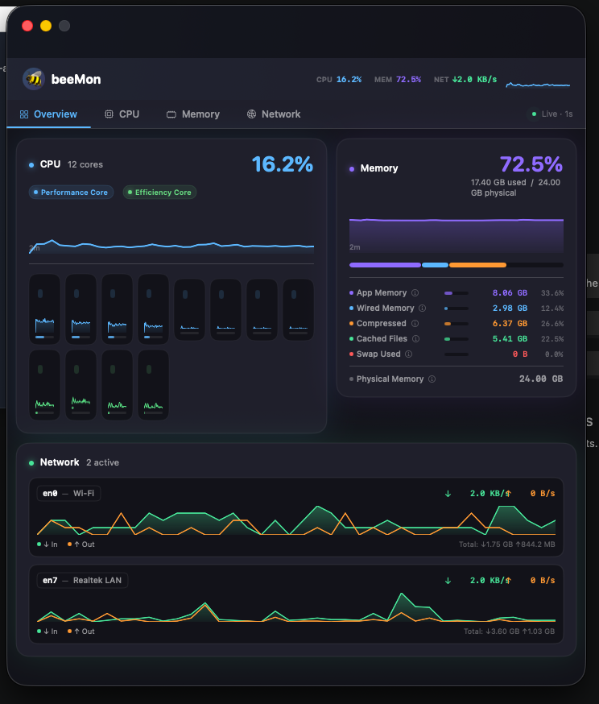

# 🐝 beeMon

**A beautiful native macOS system monitor** — CPU per-core, memory breakdown, and network bandwidth, displayed in a sleek dark dashboard with a live menu bar sparkline.

Built with pure Swift / SwiftUI. No third-party dependencies. macOS 13+ required.

---

<p align="center">
  
</p>

---

## Features

| Category | What you get |
|---|---|
| **CPU** | Per-core sparklines with P/E core class badges, live usage bars, total aggregate graph |
| **Core zoom** | Click any core cell → full overlay with large sparkline, Now / Avg / Peak stats |
| **Memory** | App · Wired · Compressed · Cached Files · Swap — segmented pressure bar + click-ⓘ explanations |
| **Network** | Per-interface ↓↑ bandwidth, friendly names (`en0 — Wi-Fi`), 2-minute activity window |
| **Time windows** | Toggle between **2m** and **10m** rolling history on every dedicated tab |
| **Menu bar** | Live CPU sparkline + percentage — left-click to open, right-click for menu |
| **Overview tab** | CPU + Memory side-by-side, top 2 active network interfaces, no scrolling |
| **About panel** | Animated hex-grid background, version, system info, credits |
| **1-second updates** | All metrics sampled every second; 600-sample (10 min) rolling buffer |

---

## Quick start

```bash
git clone https://github.com/007Style/beeMon.git
cd beeMon
swift run
```

Look for the CPU sparkline in your menu bar. Left-click to open the dashboard.

---

## Installation

### Option A — Build from source

```bash
./scripts/build.sh --release
open .build/release/beeMon
```

### Option B — Download the app bundle

Grab the latest `beeMon-v*.zip` from the [Releases](https://github.com/007Style/beeMon/releases) page, unzip, and drag `beeMon.app` to `/Applications`.

### Option C — Open in Xcode

```bash
open Package.swift
```

Then **Product → Run** (`⌘R`).

---

## Usage

| Action | Result |
|---|---|
| **Left-click** tray icon | Toggle dashboard open / closed |
| **Right-click** tray icon | Context menu: Open · About · Quit |
| **Click a CPU core cell** | Zoom overlay with full-size sparkline |
| **Esc / click backdrop** | Dismiss zoom overlay |
| **Click ⓘ** (Memory) | Floating popover explaining that metric |
| **2m / 10m pill** (tab views) | Switch graph time window |

---

## Scripts

```bash
./scripts/build.sh              # debug build
./scripts/build.sh --release    # optimised release build
./scripts/test.sh               # run 50-test unit suite
./scripts/release.sh 1.0.0      # create dist/beeMon.app + zip
./scripts/lint.sh               # swift-format + SwiftLint (optional)
```

---

## Architecture

```
Sources/beeMon/
├── main.swift                    AppDelegate + NSApplication entry point
├── Info.plist                    Bundle metadata
│
├── Models/
│   ├── SystemMonitor.swift       CPU (IOKit) · Memory (Mach VM) · Network (getifaddrs)
│   └── InterfaceNamer.swift      networksetup query + pattern fallback for friendly names
│
├── Charts/
│   └── SparklineChart.swift      SwiftUI Canvas sparkline (filled area + gradient)
│
├── Views/
│   ├── DesignSystem.swift        DS colour tokens · MetricCard · TimeWindowPicker · formatBytes
│   ├── DashboardView.swift       Tabbed main window (Overview · CPU · Memory · Network)
│   ├── CPUView.swift             CPU section + per-core grid + CoreZoomOverlay
│   ├── MemoryView.swift          Memory section + MemoryMetricRow + TooltipLabel popover
│   ├── NetworkView.swift         Network section + InterfaceRow
│   └── AboutView.swift           About panel + HexGridBackground animation
│
└── Tray/
    └── TrayController.swift      NSStatusItem sparkline icon + window management

Tests/beeMonTests/
└── beeMonTests.swift             50 self-contained unit tests
                                  (RollingBuffer · formatBytes · InterfaceNamer ·
                                   MemorySample · CPUSample · InterfaceStats · TimeWindow)
```

### Data flow

```
1 Hz Timer (SystemMonitor)
    │
    ├─ host_processor_info  →  CPUSample  →  RollingBuffer<CPUSample>  (600 cap)
    ├─ host_statistics64    →  MemorySample →  RollingBuffer<MemorySample>
    └─ getifaddrs           →  NetworkSample → RollingBuffer<NetworkSample>
           │
           └─ @Published  →  SwiftUI views re-render
                              Views slice suffix(window.rawValue) for the chart
```

---

## Testing

```bash
swift test
```

**50 tests · 0 failures** across 8 test suites:

| Suite | Tests | Covers |
|---|---|---|
| `RollingBufferTests` | 8 | Eviction, capacity, ordering, edge cases |
| `FormatBytesTests` | 7 | B / KB / MB / GB formatting, `/s` suffix |
| `InterfaceNamerTests` | 14 | Pattern fallback, map override, full label |
| `MemorySampleTests` | 4 | `usedPercent` computed property |
| `CPUSampleTests` | 4 | Storage, unique IDs |
| `InterfaceStatsTests` | 5 | `isActive` all branches |
| `TimeWindowTests` | 6 | Raw values, labels, window slicing |
| `WindowedHistoryTests` | 2 | Suffix slicing with full / partial buffers |

---

## Requirements

- macOS 13 Ventura or later (Apple Silicon or Intel)
- Xcode 15+ / Swift 5.9+ (to build from source)

---

## Privacy

beeMon reads only system performance counters via public macOS APIs:

- `host_processor_info` — CPU load ticks
- `host_statistics64` — VM page statistics
- `vm.swapusage` sysctl — swap file usage
- `getifaddrs` — network interface byte counters
- `networksetup -listallhardwareports` — interface friendly names (once at launch)

No data leaves your machine. No network requests. No analytics.

---

## License

MIT License — see [`LICENSE`](LICENSE) for full text.

---

## Credits

<p align="center">
  <strong>From the minds of Daneyand &amp; IBM's Bob 🐝</strong>
</p>

---

*beeMon v1.0.0*
